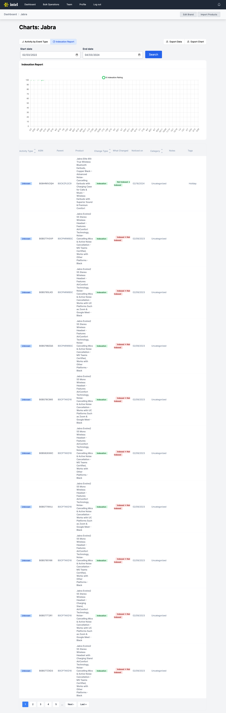

# Thanks for checking out my work! 👩‍💻

### About Me
Hi there! I'm Merel, a passionate software engineer with a product driven mindset. I build user centric applications and am motivated by producing code I am proud of. 

### Featured Works 🌟

#### UN World Ocean's Day:
- Custom web development to promote the UN World Ocean's Day.

# Key Accomplishments:
- Programmed the events calendar page and implemented user submission for world wide events with appropriate location information, event detail, and various search options.
- Responded promptly to client feedback to create the photo competition page to display award winning photography. 
- Made site wide edits using SFTP to ensure a smooth deployment from staging to production environments. 
- Photo Competition Page: 
- Calendar Page: 
- Home Page: 

#### Intel
- Provided the client with a dashboard to analyze data gathered from a third party API to track product status and changes in real time.

# Key Accomplishment:
- Overhauled the data display to allow users to visualize graphics of data, manipulate what data is displayed, and export data via .csv or .png. 
- Rerouted the architecture to enhance the interactivity of the charts and tables to ensure greater usability.
- Chart Page: 

#### Ren Platform
- Collaborated with product team and customer success to innovate software as a service aiding in the decarbonization of the global supply chain via Climate Tech Start-Up Company.

Key Accomplishment:
- Architected and implemented a robust system overhaul to optimize user experience, strategically rerouting key functionalities to enhance accessibility and streamline operations for clients. 

- Correlations Dashboard: 
- Timeline Dashboard: 

### Let's Connect! 🌐

- [Portfolio Website](https://mereljac.dev.com)
- [GitHub](https://github.com/MerelJac)
- [LinkedIn](https://www.linkedin.com/in/merel-b-jacobs)

