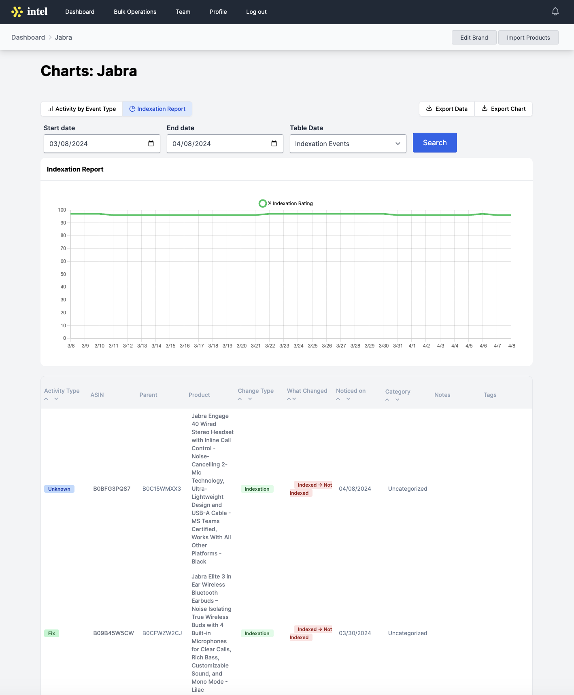

`# Thanks for checking out my work! 👩‍💻

### About Me
Hi there! I'm Merel, a passionate software engineer with a product-driven mindset. I build user-centric applications and am motivated by producing code I am proud of.

# Table of Contents

[Featured Works](#featured-works-)
   - [UN World Ocean's Day](#un-world-oceans-day)
   - [Intel](#intel)
   - [Ren Platform](#ren-platform)
   - [World of Westgate Email Marketing](#world-of-westgate-email-marketing)
   - [Cleveland Sight Center](#cleveland-sight-center)

[Let's Connect!](#lets-connect-)

### Featured Works 🌟

## UN World Ocean's Day
- Custom web development to promote the UN World Ocean's Day.

#### Key Accomplishments:
- Programmed the events calendar page and implemented user submission for worldwide events with appropriate location information, event detail, and various search options.
- Responded promptly to client feedback to create the photo competition page to display award-winning photography.
- Made site-wide edits using SFTP to ensure a smooth deployment from staging to production environments.
  
  
  
  

## Intel
- Provided the client with a dashboard to analyze data gathered from a third-party API to track product status and changes in real-time.

#### Key Accomplishment:
- Overhauled the data display to allow users to visualize graphics of data, manipulate what data is displayed, and export data via .csv or .png.
- Rerouted the architecture to enhance the interactivity of the charts and tables to ensure greater usability.
  
  
  

## Ren Platform
- Collaborated with product team and customer success to innovate software as a service aiding in the decarbonization of the global supply chain via Climate Tech Start-Up Company.

#### Key Accomplishment:
- Architected and implemented a robust system overhaul to optimize user experience, strategically rerouting key functionalities to enhance accessibility and streamline operations for clients.
  
  
  

## World of Westgate Email Marketing 
- Created email templates hosted on AWS S3 buckets.
- Tested design to ensure compatability with multiple email providers. 
  
  

## Cleveland Sight Center 
- Created site with semantic HTML and JavaScript. 

  

## Moms First
- Custom web development to promote the Moms First Summit and Motherhood page release.

  

### Let's Connect! 🌐

- [Portfolio Website](https://mereljac.dev)
- [GitHub](https://github.com/MerelJac)
- [LinkedIn](https://www.linkedin.com/in/merel-b-jacobs)
